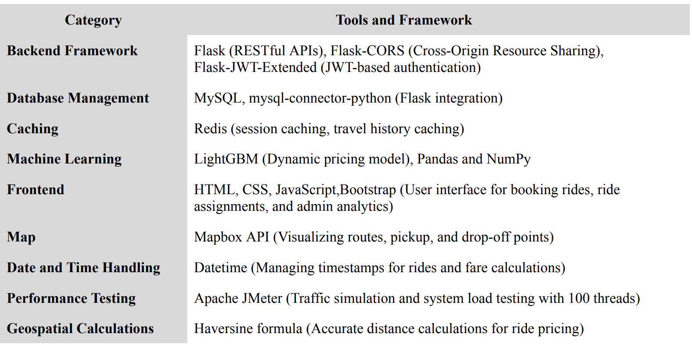
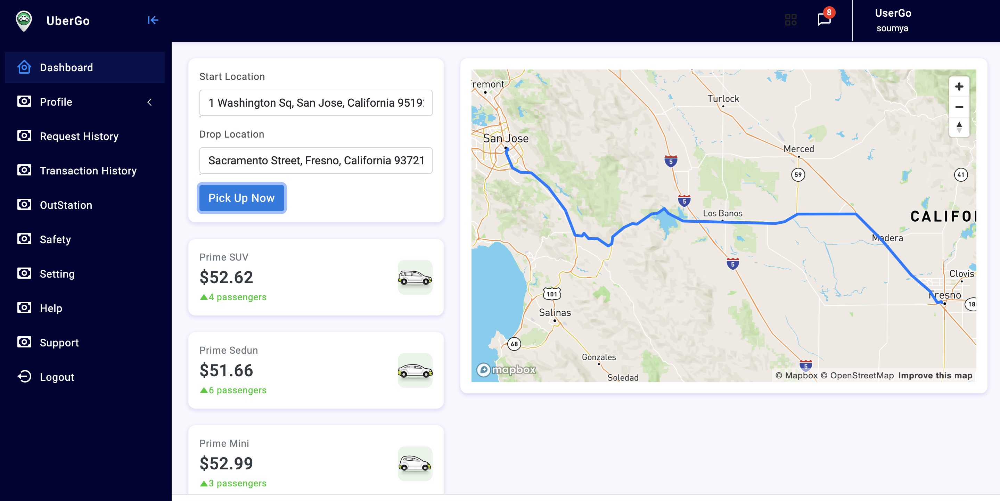

# UberGo

## Implemented uber like ride service system with below features:

1. Surge fair calculation based on number of drivers in 10 miles radius of customer's current
location.
2. Allow customer to select driver within 10 miles radius of his/her location.
3. Google maps integration for allowing customer to select starting point and destination.
4. Bill generation and management of rides history for customers and drivers
5. Statistics: Revenue, Total number of rides, Total customers and drivers
6. Deployed the website on AWS

public ip: 3.129.95.65  
urls:  
http://3.129.95.65/driver/login.html  
http://3.129.95.65/user/login.html  
http://3.129.95.65/admin/login.html  

Performance Testing for: 10,000 drivers and 10000 customers 

## Tech Stack:

## Screenshot:

For more screenshots, please refer the report. 

## BACKEND
1. pip install -r requirements.txt
2. python application.py

For DB connection, open xamp and start mySQL

## FRONTEND
in xamp folder, navigate to htdocs. Remove all files inside htdocs folder and add the frontend folders to this.
in browser, enter localhost/
Click on respective folders to navigate to login portals.
